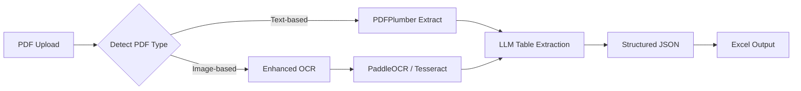

# Improving PDF-to-Excel Converter for Image-Based Bank Statements

## Problem Analysis

Your current implementation faces two key challenges:

1. **Image-based PDFs (scanned documents)**: Some bank statements are scanned images converted to PDF - the entire page is a single image with no extractable text layers
2. **Table extraction accuracy**: Even when OCR extracts text, it often fails to preserve table structure, leading to misaligned columns and incorrect data mapping

### Current Implementation Review

| Component | Current Approach | Limitation |
|-----------|-----------------|------------|
| universal_parser.py | Hybrid OCR + layout-aware parsing | Quality depends on OCR and layout consistency |

---

## Recommended Solution: Hybrid OCR + LLM Approach

The most effective solution combines **enhanced OCR** with **LLM-based table understanding**:



---

## Proposed Changes

### Component 1: Enhanced OCR Pipeline

#### [NEW] [paddleocr_processor.py](file:///Users/sasikumarad/Documents/Personal/PDF-XLS-Converter/parsers/paddleocr_processor.py)

New OCR processor using PaddleOCR for superior table detection:

- **Why PaddleOCR?**
  - Built-in **table structure recognition** (TSR) - identifies table boundaries and cells
  - Superior accuracy on complex layouts compared to Tesseract
  - Handles skewed/rotated scans automatically
  - Open source, no API costs

- **Features to implement:**
  - Table detection with bounding boxes
  - Cell-level OCR with spatial coordinates
  - Automatic image preprocessing (deskew, enhance contrast)
  - Fallback to Tesseract for simple documents

---

### Component 2: LLM-Based Table Extraction

#### [NEW] [llm_table_extractor.py](file:///Users/sasikumarad/Documents/Personal/PDF-XLS-Converter/parsers/llm_table_extractor.py)

LLM integration to interpret OCR output and structure it correctly:

- **Approach Options (choose one):**

| Option | Pros | Cons |
|--------|------|------|
| **Option A: OpenAI GPT-4 Vision** | Best accuracy, can process images directly | API costs (~$0.01-0.03/page), requires API key |
| **Option B: Claude/Gemini API** | Excellent structured output, fast | Same cost concerns as GPT-4 |
| **Option C: Local Ollama + Vision Model** | No API costs, privacy-friendly | Requires GPU, slower processing |
| **Option D: Rule-based + GPT fallback** | Cost-efficient (LLM only for failures) | More complex logic |

> [!IMPORTANT]
> **User Decision Required**: Which LLM approach do you prefer?
> - If processing many statements: Option D (hybrid) is cost-effective
> - If accuracy is paramount: Option A (GPT-4 Vision) works best
> - If privacy/offline is critical: Option C (Ollama)

- **Optimization Strategy:**
  - **Chunking**: Split large documents into 5-page chunks
  - **Parallel Processing**: 5 concurrent threads for 5x speedup
  - **Output Format**: CSV (more reliable/compact than JSON)
  - **Dynamic Columns**: Auto-detect column headers from first page

- **LLM Prompt Strategy:**
  ```
  Extract transactions from this bank statement OCR text.
  The columns are: [Detected Columns]
  Return as CSV data with no headers.
  Match values to columns strictly.
  ```

---

### Component 3: Universal Bank Parser

#### [NEW] [universal_parser.py](file:///Users/sasikumarad/Documents/Personal/PDF-XLS-Converter/parsers/universal_parser.py)

A generic parser that works with any bank format:

- Auto-detects table structure using OCR coordinates
- Uses LLM to understand column headers and map values
- Prioritizes raw, exact-column output

---

### Component 4: Modified Base Parser

#### [MODIFY] [base_parser.py](file:///Users/sasikumarad/Documents/Personal/PDF-XLS-Converter/parsers/base_parser.py)

Add methods for:
- Image preprocessing (OpenCV enhancements)
- OCR engine selection (Tesseract vs PaddleOCR)
- LLM API integration abstraction

---

### Component 5: Updated Dependencies

#### [MODIFY] [requirements.txt](file:///Users/sasikumarad/Documents/Personal/PDF-XLS-Converter/requirements.txt)

```diff
# Existing dependencies...
+paddlepaddle>=2.5.0
+paddleocr>=2.7.0
+openai>=1.0.0  # Optional, for LLM extraction
+httpx>=0.25.0  # For Ollama local API calls
```

---

## Alternative Approaches Considered

### 1. PaddleOCR Table Recognition (Standalone)
- **How it works**: PaddleOCR has built-in table structure recognition that detects cells
- **Pros**: No LLM costs, faster processing
- **Cons**: May struggle with unusual layouts, no semantic understanding

### 2. Document AI Services
- **Google Document AI**: Excellent accuracy, pay-per-page pricing
- **AWS Textract**: Good table extraction, familiar AWS ecosystem
- **Azure Form Recognizer**: Pre-trained for financial documents
- **Cons**: All require cloud accounts and incur costs

### 3. Donut / LayoutLM Models
- **How it works**: End-to-end document understanding models
- **Pros**: State-of-the-art accuracy, local processing
- **Cons**: Complex setup, requires GPU, slower than API

---

## Recommended Implementation Order

1. **Phase 1**: Add PaddleOCR as enhanced OCR engine
2. **Phase 2**: Implement LLM extraction layer (start with OpenAI, can swap later)
3. **Phase 3**: Create universal parser combining both
4. **Phase 4**: Add bank format auto-detection
5. **Phase 5**: Optimize (caching, batch processing, cost reduction)

---

## Verification Plan

### Automated Testing

Currently no test files found in the project. Will create:

#### [NEW] [test_parsers.py](file:///Users/sasikumarad/Documents/Personal/PDF-XLS-Converter/tests/test_parsers.py)

```bash
# Run tests
python -m pytest tests/test_parsers.py -v
```

### Manual Verification

1. **Test with known image-based PDF**:
   - Upload a scanned bank statement
   - Verify transactions extracted correctly
   - Compare with expected values

2. **Test with mixed PDF types**:
   - Upload both text-based and image-based PDFs
   - Verify system auto-detects and uses appropriate pipeline

> [!NOTE]
> Please share 1-2 sample PDF statements (with sensitive data redacted) so I can test the implementation against real documents.

---

## Scalability Architecture (1000+ Concurrent Users)

To handle high concurrency (e.g., 1000 users), the current synchronous Flask architecture is insufficient.

### Recommended Architecture: Async Task Queue
Move from synchronous processing to an asynchronous Producer-Consumer model:

```mermaid
flowchart LR
    User[Clients] -->|Upload| Web[Web Tier (Flask/FastAPI)]
    Web -->|Push Job| Queue[Redis Queue]
    Web -->|202 Accepted| User
    
    subgraph Worker Cluster
        Worker1[Worker Node]
        Worker2[Worker Node]
        WorkerN[Worker Node]
    end
    
    Queue --> Worker1
    Queue --> Worker2
    Queue --> WorkerN
    
    Worker1 -->|LLM API| OpenAI
    Worker1 -->|Save Result| DB[(Database/S3)]
```

1.  **Web Tier**: Lightweight, handles uploads only. Returns a Job ID immediately.
2.  **Queue**: Redis/Celery buffers bursts of traffic.
3.  **Worker Tier**: Auto-scaling cluster of workers that process documents.
    *   Can scale horizontally (add more servers).
    *   Isolates CPU-heavy OCR tasks from the web server.

---

## Security & Data Privacy

### 1. Data Retention
*   **Bounded Retention**: Temporary inputs and outputs are removed automatically after their configured processing, download, or feedback window.
*   **OpenAI Zero Retention**: Negotiate "Zero Data Retention" usage with OpenAI (API data is not trained on).

### 2. Encryption
*   **In-Transit**: TLS 1.3 for all web traffic.
*   **At-Rest**: If storing files (e.g., S3), use server-side encryption (SSE-S3).

### 3. Access Control
*   Implement strict User Authentication (OAuth2/SAML).
*   Rate limiting per user (already implemented) prevents DDoS.

---

## Cost Analysis & Optimization

*   **Current Cost**: ~$0.003 per page (GPT-4o-mini).
*   **For 20 pages**: ~$0.06 per document.
*   **For 1000 users**: $60.00 burst cost.

**Cost Control Strategies:**
1.  **Hybrid Parsing**: Use free regex parsing for simple text PDFs; use LLM only for complex/image PDFs.
2.  **Caching**: Hash documents (SHA-256) to prevent reprocessing the same file.
3.  **Tiered Pricing**: Pass costs to enterprise users via subscription.

---

## Deployment & Infrastructure (Railway.com)

**Verdict**: Railway is an **excellent choice** for this application.

### Why Railway?
1.  **Docker Support**: Native support for custom Dockerfiles (essential for PaddleOCR dependencies).
2.  **Redis Add-on**: One-click Redis deployment (needed for Task Queue).
3.  **Cost**: Pay-per-minute execution model fits the bursty nature of document processing.
4.  **Scaling**: Can easily scale worker services independently of the web frontend.

### Service Structure
*   `web`: Flask application (handles uploads and authenticated status polling).
*   `worker`: Celery worker (processes PDFs).
*   `scheduler`: One Celery Beat replica (enqueues hourly retention sweeps).
*   `redis`: Message broker and status store.

---

## UI Feedback (Progress Tracking)

To handle long-running jobs (e.g., 3-5 mins), we need real-time feedback.

### Architecture
1.  **Redis status snapshots**: Workers store expiring JSON progress records.
2.  **Authenticated polling**: The browser polls `/status/<job_id>` every two seconds while visible and more slowly while hidden.
3.  **Flow**:
    *   User uploads a file and receives a job ID.
    *   Worker updates progress (for example, "Processing Page 5/20") in Redis.
    *   The web service verifies job ownership and returns the latest snapshot.
    *   The client updates the progress bar and stops polling on completion or error.

---

## Documentation Strategy

*   **Internal Docs**: All architecture diagrams and setup guides will be stored in `docs/` within the repository.
*   **User Guide**: A `UserGuide.md` will be created for end-users explaining how to use the app.
